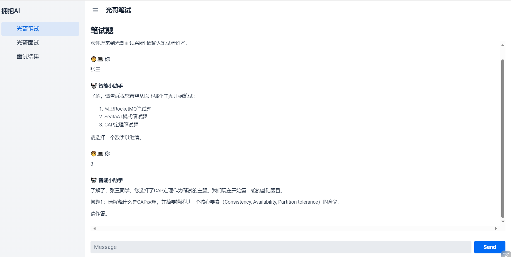
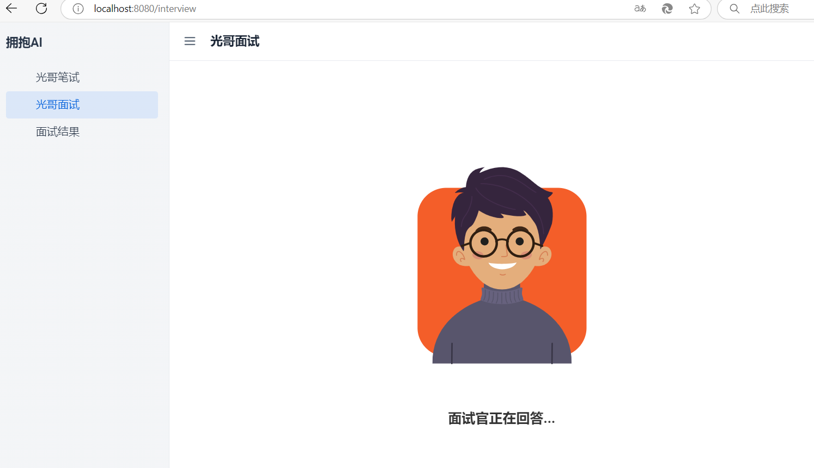
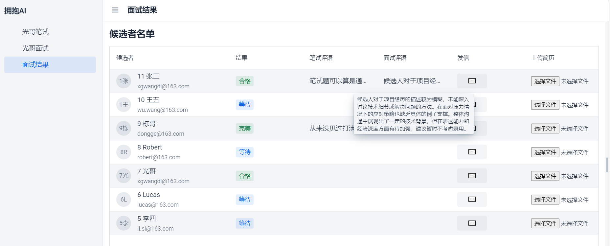

# 🤖 AI Interviewer - 下一代智能面试官系统

[](https://opensource.org/licenses/Apache-2.0)
[](https://makeapullrequest.com)
[](https://github.com/yourname/ai-interviewer)

**首个支持全流程技术面试的开源AI系统** | **RESTful API设计** | **代码实操评估** | **多模态行为分析**

<p align="center">
  
</p>

## 🌟 为什么选择AI Interviewer？

### 开发者痛点
- 😰 技术面试缺乏真实场景练习
- 📚 传统刷题无法培养沟通表达能力
- ⏳ 人工模拟面试成本高昂

### 我们的优势
✅ **轻量级架构** - 基于REST API，易于集成  
✅ **深度技术评估** - AST解析+LLM代码评审双引擎  
✅ **智能进化系统** - 每周自动更新面试题库  
✅ **多模态分析** - 语音/代码/表情多维度评估

## 🚀 核心功能速览

| 功能模块         | 技术亮点                          | 应用场景                   |
|------------------|-----------------------------------|---------------------------|
| 智能问答引擎     | GPT-4 + 本地知识库混合推理        | 技术概念考察               |
| 代码实操评估     | JavaParser + 自定义规则引擎       | 算法题/系统设计题实战      |
| 语音交互系统     | REST API + 异步任务队列           | 模拟技术沟通场景           |
| 行为分析仪表盘   | OpenCV情绪识别 + 代码热力图       | 面试表现多维可视化         |

## ⚡ 快速开始

5分钟开启你的第一次AI面试：

```bash
# 1. 克隆仓库
git clone https://github.com/xgwangdl/AI-Interview.git

# 2. 启动服务（需要Docker）
cd ai-interviewer
docker-compose up -d

# 3. 访问API文档
open http://localhost:8080/swagger-ui.html

# 4. 项目展示
1.笔试面试界面

2.面试界面
面试官提问

面试者回答

3.面试结果界面


# 项目名称
作者: 大连光哥  
技术栈: JAVA、AI 、React 
邮箱: xgwangdl@163.com  
